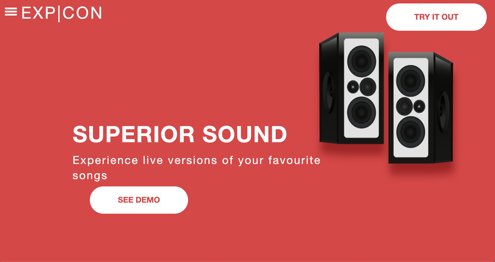
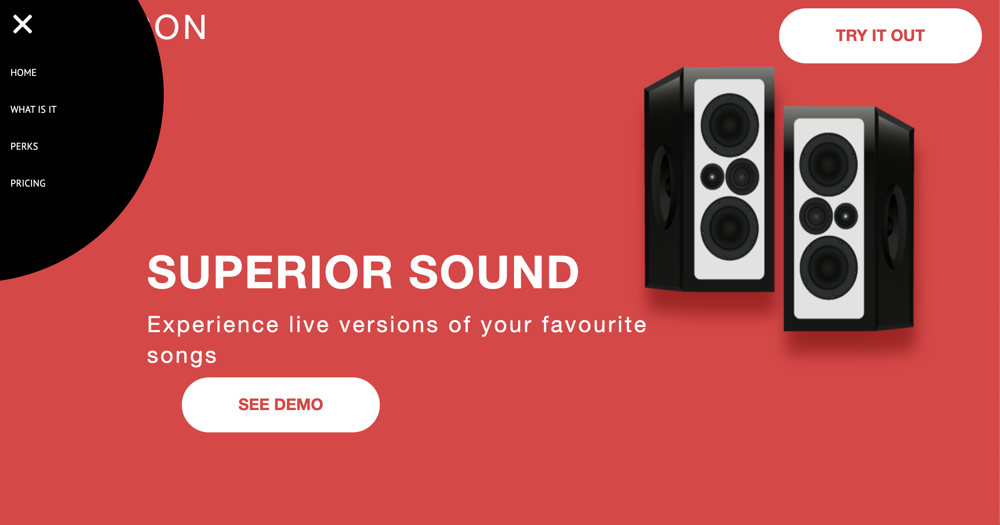

# EXP|CON
EXP|CON is a website for interactive concert experience.





 ## Technologies
- HTML
- CSS
- JQUERY
- JAVA SCRIPT


# Getting Started
You can find the Code in:
- `index.html`
- `whatIsIt.html`

And the CSS style in: `index.css`


```
Required! Gulp installed `npm install -g gulp`
```

```
$ npm install
$ npm run dev  
Front-end boilerplate for creating new web projects with Gulp.js and everything you need to get started.
```